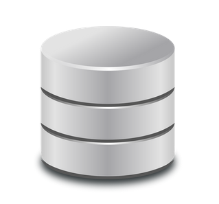
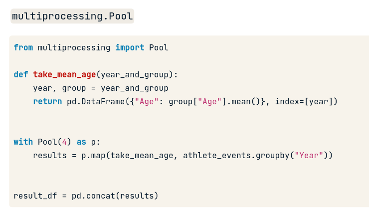
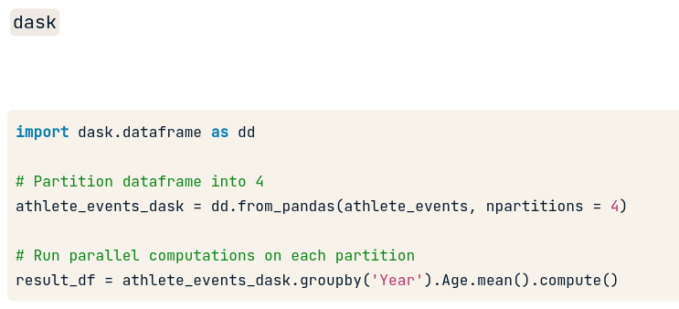

# Chapter 1 : Các công cụ làm việc trong mảng Data Engineering

## I. Database

### 1. Database là gì?

Database là tập hợp dữ liệu lớn được tổ chức đặc biệt để tìm kiếm và rút trích dữ liệu nhanh.



Các đặc điểm của nó:
* Lưu trữ dữ liệu
* Tổ chức dữ liệu
* Rút trích/Tìm kiến dữ liệu thông qua DBMS

### 2. Phân biệt dữ liệu **có cấu trúc** và dữ liệu **không cấu trúc**

#### Có cấu trúc: 
Database có schema, ví dụ như các relational database

#### Bán cấu trúc (semi-structured): 
Ví dụ như file JSON
```
 { “key” : “value” }
```

#### Không cấu trúc: 
Không có schema, giống như các tập tin : videos, hình ảnh


### 3. Phân biệt SQL và NoSQL
#### SQL database có những đặc điểm sau:
* Có các bảng để truy vấn
* Có Database schema (xác định sự liên hệ và thuộc tính của database)
* Có các Relational database (có quan hệ với nhau)
* Các hệ quản trị cơ sở dữ liệu phổ biến của ngôn ngữ này: MySQL, PostgreSQL


#### NoSQL database có những đặc điểm sau:
* Có các Non-relational database
* Thường gắn với các dữ liệu không có schema (unstructured), nhưng đôi khi có các dữ liệu có schema (structured)
* Lưu trữ các cặp key-value (e.g. dùng cho caching hoặc cấu hình phân tán “distributed configuration”)
* Những ứng dụng thường dùng NoSQL là những ứng dụng chứa cặp key-value như Redis hoặc MongoDB có model là document database.

*Các giá trị trong document database thường là các object có cấu trúc hoặc bán cấu trúc, ví dụ như JSON object.


### 4. SQL: Tìm hiểu về Database chema

#### Database schema có vai trò gì?
> Có nhiệm vụ mô tả cấu trúc và các mối quan hệ của các bảng trong database thông qua SQL code và sơ đồ schema


### Star schema
Trong datawarehouse database, thường những schema chúng ta thấy là star schema có sơ đồ giống như hình ngôi sao.

Fact table ở giữa và xung quanh là các Dimension tables, trong đó:
* Fact table: là table chứa các dữ liệu xảy ra trên thế giới như product orders, v.v	
* Dimension table: là các table mang thuộc tính để mô tả cho fact table như màu sắc, kích thước, v.v

Tìm hiểu thêm về Star chema [tại đây](https://en.wikipedia.org/wiki/Star_schema)


*Ví dụ thực tế:*
Giả sử ta có database mô tả cấu trúc dữ liệu cho hệ thống bán hàng ở 1 cửa hàng quần áo:


Giả sử ta có bảng invoice lưu dữ liệu bán hàng (fact table) có các cột sau:

| id (primary key) | created_date_time | items_id | payment_method | customer_id | card_id |
|  -------------------  |  -------------------  | -------------------  |-------------------  |-------------------  |------------------- |
| 123 | 12:00:00 | 12/12/2021 | 1 | Bank | 111 | 9116 |


Ta sẽ có các bảng dimension sau để bảng invoice liên kết mối quan hệ nhằm mô tả chi tiết các giao dịch invoice:

Bảng Item

| id | item_name | category | color | price |
| ------- | ------- | ------- | ------- | ------- | 
| 1 | Quần đùi lửng | Quần | Đen | 200000 |

Bảng Customer 

| id | name | birthday | card_id | is_valid | num_of_orders |
| ------- | ------- | ------- | ------- | ------- |  ------- | 
| 111 | Thanh Tuyền | 09/XX/XXXX | 9116 | 0 | 5 |


Bảng Card

| id | customer_id | point | expired_date | 
| ------- | ------- | ------- | ------- | 
| 9116 | 111 | 2100 | 31/12/2025 |


****************


## II. Parallel computing 

### Parallel computing là gì?

Trước tiên ta đi từ ý tưởng của việc tạo ra parallel computing.
* Nó hình thành nên nền móng cho các công cụ xử lý data hiện đại (data processing tool)
* Tuy nhiên lí do quan trọng nhất phải nói đến là để tối ưu **Bộ nhớ và hiệu năng xử lý dữ liệu**

#### Cách thức hoạt động:
* Chia task thành nhiều task phụ
* Phân tán task phụ trên một vài máy tính (thường là các [commodity computer](https://whatis.techtarget.com/definition/commodity-computer#:~:text=A%20commodity%20computer%20is%20a,no%2Dfrills%20but%20functional%20machines.) hoặc đã có sẵn để ít tốn phí thay vì sử dụng các siêu máy tính)
* Các máy tính làm việc song song với nhau trên các task phụ, do đó các task được hoàn thành nhanh hơn

Chúng ta hãy cùng xem ví dụ vận hành shop may đồ:


Đặt mục tiêu may 100 cái áo, thì shop nhận thấy:
* Nhân viên may giỏi nhất nhóm may 1 cái áo trong 20 phút => 12 cái áo trong 4 tiếng
* Những nhân viên khác thì may 1 cái áo trong 1 tiếng

Sau khi áp dụng mô hình parallel bằng cách:
* Chia ra 4 chu kỳ
* Mỗi chu kì 25 cái áo và 4 nhân viên may làm việc song song
Thì ta thấy được nếu các nhân viên may có khả năng thấp hơn khi cùng làm việc song song với nhau thì sẽ làm được 16 cái áo trong 4 tiếng.

Nói về thực tế máy tính, 4 nhân viên may có năng lực thấp hơn thì sẽ giống như là các máy tính có sẵn, ít tốn phí, thay vì ta phải thuê 1 nhân viên giỏi hay có thể nói là siêu máy tính thì chi phí sẽ cao hơn nhiều nhưng không chắc chắc hiệu quả bằng.

Tóm lại, lợi ích của parallel computing:
* Hiệu suất xử lý
* Bộ nhớ: chia dữ liệu thành các tập hợp con và đưa vào bộ nhớ của các máy tính khác nhau
=> mức chiếm dụng bộ nhớ tương đối nhỏ và dữ liệu được đưa vào trong bộ nhớ gần RAM nhẩt

#### Những rủi ro khi áp dụng
**Overhead due to communication**
* Yêu cầu chưa đủ lớn để áp dụng
* Cần nhiều processing units hơn
* Đôi khi tách ra sẽ gặp vấn đề về program runtime, yêu cầu tốn nhiều thời gian để xử lý giao tiếp giữa các processes hơn so với không tách ra. Việc có nhiều chương trình hơn sẽ khiến thời gian contact switch giữa các chương trình nhiều hơn không phù hợp khi yêu cầu chưa đủ lớn. Xem hình bên dưới:


#### Code Python để chia thành nhiều task phụ
##### Sử dụng API **multiprocessing.Pool**



##### Sử dụng DASK framework để tránh viết API dưới hệ thống 




Một số ghi chú cho Parallel computing:

> * Không phải lúc nào cũng tăng thời gian xử lý công việc, do hiệu ứng của overhead communication ở phần contact switch giữa các ứng dụng.
> * GIúp tối ưu việc sử dụng bộ xử lý đa nhiệm (multiple processing unit)
> * Giúp tối ưu bộ nhớ giữa một số hệ thống 

Bài viết về Parallel computing đến đây là kết thúc, các bạn có thể xem qua 1 số đoạn code liên quan đến chủ đề này ở repo data-engineering của mình nhé! 

-----------------------------------------

## III. Parallel computation framework

### 1. Hadoop

Hadoop là tập hợp các dự án open-source được maintain bởi Apache Software Foudation. Có 2 dự án phổ biến thường được nhắc đến là **MapReduce** và **HDFS**. 


#### a. Nói về HDFS  
Đây là tên gọi của hệ thống phân tán tập tin (distributed file system). Cũng là các tập tin trong máy tính nhưng được điều đặc biệt là nó được phân tán trên nhiều máy tính khác nhau. 

HDFS là một phần thiết yếu trong Big data để lưu trữ dữ liệu lớn.


#### b. Nói về MapReduce 
Đây là một trong các mô hình đầu tiên phổ biến trong việc xử lý Big data.
Cách hoạt động của nó là chia task lớn thành nhiều task nhỏ rồi phân tán khối lượng dữ liệu và dữ liệu đến các đơn vị xử lý (processing unit).
Tuy nhiên, MapReduce có một số khuyết điểm có thể kể đến như khó viết các job để chia task và phân tán chẳng hạn.
> Chương trình phần mềm **Hive** và một só phần mềm khác ra đời để giải quyết khó khăn trên.

Hive như là lớp vỏ trên cùng trong hệ sinh thái của Hadoop giúp các dữ liệu đến từ những nguồn khác nhau có thể truy vấn bằng cách sử dụng ngôn ngữ truy vấn có cấu trúc Hive SQL (HQL).

Ví dụ đoạn truy vấn Hive SQL:


> **Nhận xét:** trông chả khác câu lệnh SQL thông thường phải không ? ^^ Tuy nhiên sau tấm màn đó thì mọi thứ sẽ khác. Câu truy vấn trên sẽ chuyển đổi thành job có nhiệm vụ phân tán đến tập hợp các máy tính đấy (cluster). 

### 2. Spark framework
Ngoài Hadoop, ta còn có Spark, cũng có nhiệm vụ phân tán các task xử lý dữ liệu giữa các cluster, ngày nay được sử dụng phổ biến hơn.

Trong khi hệ thống Hadoop MapReduce cần ổ đĩa đắt tiền để ghi dữ liệu giữa các job, thì Spark lại sử dụng một cách tối ưu bộ nhớ xử lý tránh sử dụng ổ đĩa để ghi dữ liệu.

Spark ra đời đã cho thấy những hạn chế của MapReduce, trong đó bao gồm việc MapReduce hạn chế tương tác của người dùng khi truy cập phân tích dữ liệu và mỗi bước build sẽ phải dựa trên bước trước đó. => không linh hoạt, khó tương tác hơn Spark.


#### a. Kiến trúc của Spark

Dựa trên RDDs (Resilient distributed datasets)

RDD là một loại cấu trúc dữ liệu có nhiệm vụ duy trì các dữ liệu được phân tán giữa nhiều node.

Không giống với DataFrame, RDDs không có các cột. Về khái niệm thì có thể xem nó là một dãy các tuples, ví dụ về tuple "day":
```
day = ('monday', 'tuesday', 'wednesday' , 'thursday', 'friday', 'saturday' , 'sunday')
```

Với các dữ liệu có cấu trúc RDD ta có thể thực thi 2 loại lệnh :
* Chuyển đổi: dùng method .map() hoặc .filter() => output ra các dạng dữ liệu đã được chuyển đổi
* Hành động: dùng method .count() hoặc .first() => ra 1 output duy nhất (số, chữ, v.v) 

Spark framework có nhiều interface ứng với các ngôn ngữ lập trình, phổ biến nhất là PySpark dùng ngôn ngữ Python. Ngoài ra còn có các ngôn ngữ khác như Scala, R.

> **PySpark dùng host dựa trên Dataframe trừu tượng, đó là lí do nếu chúng ta thường sử dụng thư viện pandas của dataframe sẽ dễ làm quen hơn vì hoạt động của PySpark sẽ tương tự thế. 

>> Tóm lại là các công việc về parallel computing từ đơn giản đến phức tạp cứ để nhà Spark lo :smile: còn chaỵ như thế nào là tùy bạn.

Xem ví dụ về PySpark khi tính trung bình các vận động viên theo nhóm tuổi nhé:


