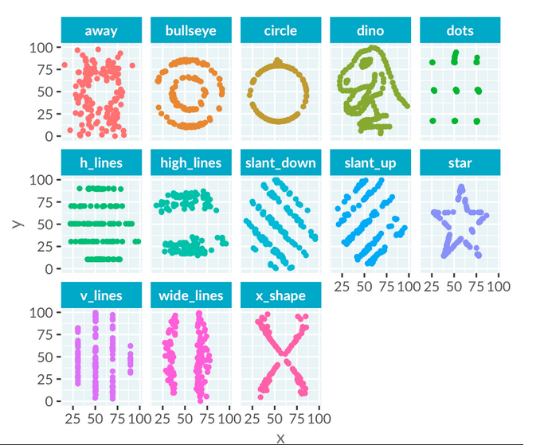
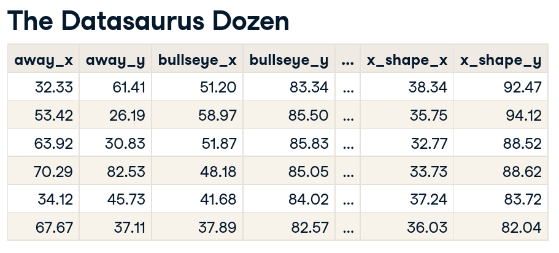
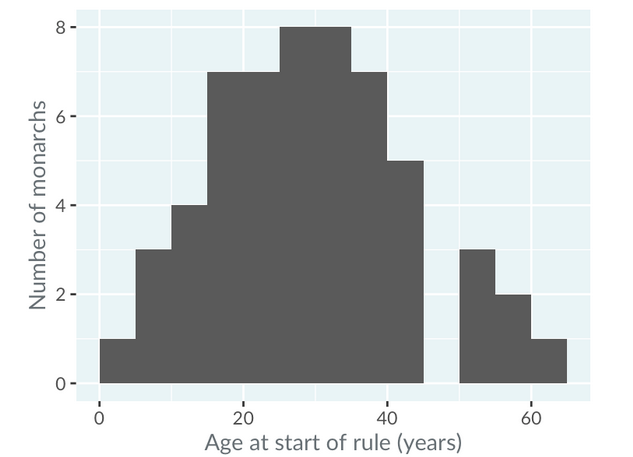
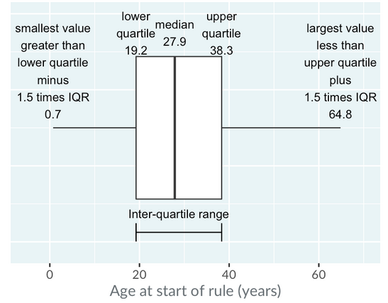
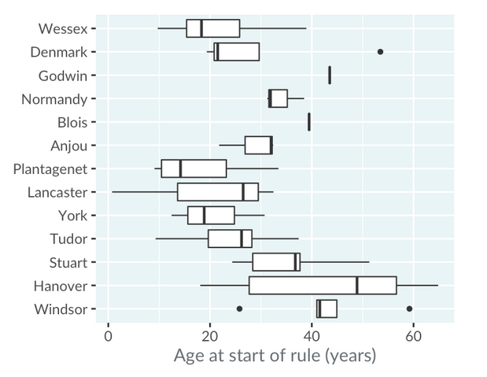

#### 1. Các loại chart cơ bản 

BAR CHART & COLUMN CHART

> Giúp ta nhìn vào giá trị cụ thể cho mỗi loại

Có 4 loại:

* Stacked bar và column chart
> Biểu đồ chồng nhau theo giá trị,

* Clustered bar và column chart
> Biểu đồ nhiều cột trong 1 phân loại

* 100% stacked bar và column chart
> Biểu đồ chồng theo %

* Combo chart
> Biểu đồ kết hợp cột và biểu đồ đường

LINE CHART
> Giúp biểu diễn chuỗi giá trị theo dạng có hình, thường là thông qua diễn tiến thay đổi của thời gian

AREA CHART 
> Dựa trên Line chart nhưng được fill màu

PIE CHART & DONUT CHART
> Biểu diễn mỗi quan hệ giữa các thành phần và tổng thể

TREE MAP
> Biểu diễn mỗi quan hệ giữa các thành phần và tổng thể, với các hình vuông có màu có kích cỡ riêng biểu thị phần mà các giá trị chiếm.

CARD & MULTI-ROW CARD

* Card
> biểu diễn 1 giá trị 

*Multi-row card
> dùng để biểu diễn nhiều giá trị

GAUGE CHART & KPI
> được thiết kế để hiển thị dữ liệu thực tế so sánh với dữ liệu ngân sách/doanh thu hoặc mục tiêu đã lên kế hoạch.

TABLE & MATRIX
> biểu diễn chi tiết dữ liệu văn bản bằng định dạng Bảng

* Table:
> chứa dữ liệu liên quan trong chuỗi logical của dòng và cột, có thể bao gồm header & footer của bảng

* Matrix:
> giống như bảng nhưng matrix có thể thu lại hoặc mở rộng ra bằng dòng hoặc cột

HIERARCHIES:
> Level data từ cao đến thấp

Ví dụ:
Year => Quarter => Month => Day
Company => Region => Country => DIvision => Unit

HÀM:
> Là các công thức được định nghĩa trước sẵn để biểu diễn các phép tính trên các giá trị gọi là tham trị ``arguments``.

#### 2. Kiến thức nền tảng để visualize data

Có 3 cách để lấy được insight của data:
* Cách 1: Tính toán thống kê
mean (trung bình), median(trung vị), standard deviation (phương sai)

* Cách 2: Run model/Chạy mô hình
Linear (Tuyến tính) hoặc hồi quy logistic

* Cách 3: Vẽ plot
scatter, bar, histogram (biểu đồ tần suất),...
Scatter plot:

##### The Datasaurus Dozen 

* Có 13 datasets, mỗi Dataset có 2 trục x và y được gọi là variable 
* Variable đơn giản chỉ là biệt ngữ thống kê để chỉ cột dữ liệu 
* Khi tính phương sai của mỗi dataset, ta sẽ tính ra 2 phương sai cho x và y trên tất cả các record. Vì dataset trên có 2 giá trị x và y.
* Phương sai dùng để tính toán sự biến thiên của dữ liệu.

##### Chọn biểu đồ chấm plot loại gì thì phù hợp?

Trước tiên phải xác định variable x và y của data thuộc loại nào. Có 3 loại:

* Continuous : thường là số và có thể làm các phép toán cho nó.
Ví dụ như nhiệt độ, chiều cao, doanh thu,...

* Categorical : thường là dạng văn bản text, những thứ được phân loại hay mô tả.
Ví dụ như màu mắt, quốc gia,...

* Cả hai loại trên
Ví dụ như tuổi thì dạng continuous, còn nhóm tuổi từ 25-30 thì lại là categorical.
Thời gian thì continuous còn tháng thì categorical.
> Ở đây tùy vào mục đích visualization mà bạn sẽ quyết định nó thuộc loại nào cho phù hợp.

##### Khi nào nên dùng biểu đồ tần suất Histogram?

* Nếu bạn có biến continuous như trên
* Khi bạn muốn biết hình dạng của sự phân tán data, ví dụ như bạn muốn biểu đồ thể hiện rõ giá trị cao nhất và thấp nhất.

Một số thuật ngữ:
* Bin (interval) : khoảng cách các ô trục trên biểu đồ, ví dụ 0-5, 5-10,... Nếu muốn rõ data hơn thì ta co bin lại 0-1, 1-2,...
Như hình, bin 10-15 tuổi có giá trị trục y là 4, nghĩa là có 4 người từ 10-15 tuổi.

Sự lựa chọn binwidth sẽ ảnh hưởng lớn đến hình ảnh biểu đồ. Dưới đây cho thấy nếu thu nhỏ bin lại còn 1 năm tuổi thì nhìn rất lộn xộn.

Các tiêu chí trải nghiệm qua để chọn binwidth phù hợp:
* Modality : có bao nhiêu đỉnh trong biểu đồ?
Unimodal, bimodal hay trimodal?

* Skewness: lệch lạc hay cân xứng?
lệch trái, phải hay cân đối ở giữa?

* Kurtosis: có bao nhiêu điểm có giá trị = 0? (extreme value) 

##### Khi nào nên vẽ Box Plots?
* Khi chúng ta có 1 variable là continuous, được tách ra phân loại bởi 1 variable categorical.
* Khi chúng ta muốn so sánh sự phân tán dữ liệu của variable continuous cho mỗi category (phân loại).

Các chỉ số trên box plots:
* lower quartile: 1/4 có giá trị dưới số này
* median : trung vị
* upper quartile: 1/4 có giá trị trên số này
* inter-quartile range: khoảng cách từ lower đến upper
 * whiskers: đường thẳng ngang hai bên, đường kẻ ra gấp 1-1,5 lần inter-quarter, dài đến mức độ đủ để biết rằng ngoài đường kẻ thì không có giá trị nào cả (extreme value).
 
 

* Phân loại nào chỉ có đường thẳng nghĩa là chỉ có 1 giá trị.
* Dấu chấm ngh